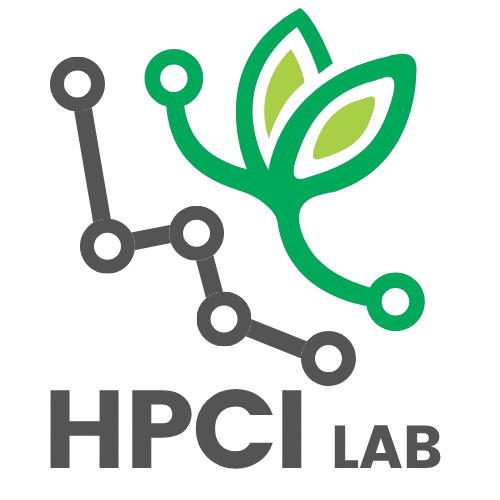

<div align="center">
  <a href="https://github.com/HPCI-Lab">
    
  </a>

  <h3 align="center">yProv4ML MLflow Plugin</h3>

  <p align="center">
    An MLflow plugin that integrates provenance tracking with sustainability metrics for ML experiments built on the yProv4ML library. 
    <br />
    <br />
    <a href="https://github.com/HPCI-Lab/yProv4ML_MLflow_Plugin/issues/new?labels=bug&template=bug-report---.md">Report Bug</a>
    &middot;
    <a href="https://github.com/HPCI-Lab/yProv4ML_MLflow_Plugin/issues/new?labels=enhancement&template=feature-request---.md">Request Feature</a>
  </p>
</div>

<br />

<div align="center">
  
[](https://github.com/HPCI-Lab/yProv4ML_MLflow_Plugin/graphs/contributors)
[](https://github.com/HPCI-Lab/yProv4ML_MLflow_Plugin/network/members)
[](https://github.com/HPCI-Lab/yProv4ML_MLflow_Plugin/stargazers)
[](https://github.com/HPCI-Lab/yProv4ML_MLflow_Plugin/issues)
[](https://opensource.org/licenses/)

</div>

An MLflow plugin that integrates [W3C PROV](https://www.w3.org/TR/prov-overview/)-compliant provenance tracking with sustainability metrics for machine learning experiments built on the [yProv4ML (prov4ml)](https://github.com/HPCI-Lab/yProvML) library. 

## 🚀 Installation

### Prerequisites

- Python 3.9 or higher
- pip package manager
- Git (for installing from source)

### Installation (Recommended)

```bash
pip install -r requirements.txt
```

```bash
# Clone the repository
git clone https://github.com/yourusername/yProv4ML_MLflow_Plugin.git
cd yProv4ML_MLflow_Plugin

# Install the plugin in development mode
pip install .
```

### Verify Installation

```bash
# Check that the plugin is registered
python -c "import mlflow; print(mlflow.__version__)"

# Verify prov4ml is installed
python -c "import prov4ml; print('prov4ml installed successfully')"

# Check plugin entry points
python -c "from importlib.metadata import entry_points; eps = [ep for ep in entry_points().get('mlflow.tracking_store', []) if 'yprov' in ep.name]; print(f'Found {len(eps)} yprov entry points')"

# Test basic functionality
python -c "import mlflow; mlflow.set_tracking_uri('yprov+file:///tmp/test'); print('✅ Plugin activated successfully')"
```

## ⚡ Quick Start

The plugin activates automatically when you use the `yprov+` URI scheme:

```python
import mlflow

# 🔑 CRITICAL: Use yprov+ prefix to activate the plugin
mlflow.set_tracking_uri("yprov+file:///path/to/mlruns")

# Standard MLflow code - no changes needed!
mlflow.set_experiment("my_experiment")

with mlflow.start_run(run_name="example_run"):
    # Log parameters
    mlflow.log_param("learning_rate", 0.001)
    mlflow.log_param("batch_size", 32)
    
    # Log metrics
    for epoch in range(5):
        mlflow.log_metric("loss", 0.5 - epoch * 0.05, step=epoch)
        mlflow.log_metric("accuracy", 0.7 + epoch * 0.05, step=epoch)
    
    # Log artifacts
    mlflow.log_artifact("model.pt", artifact_path="models")

# ✅ PROV JSON automatically generated in data/prov/my_experiment/
```

## 🙏 Acknowledgments

- [MLflow](https://mlflow.org/) - Open source ML lifecycle platform
- [yProv4ML (prov4ml)](https://github.com/zdeniztas/yProvML) - W3C PROV provenance tracking
- [CodeCarbon](https://codecarbon.io/) - Carbon emissions tracking
- [W3C PROV](https://www.w3.org/TR/prov-overview/) - Provenance standard


---
